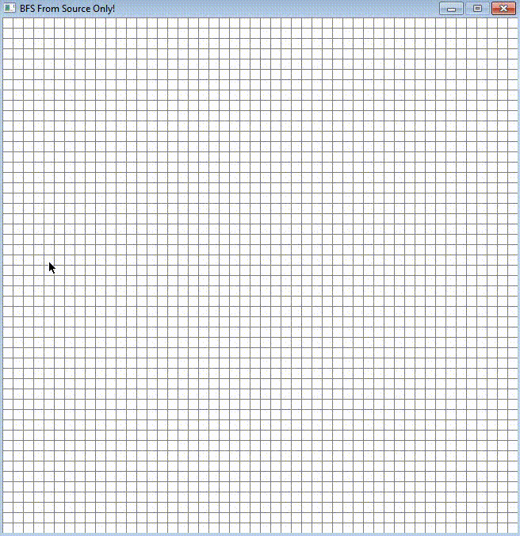

# BFS-Visualization-With-PyGame

 

### Learnt path finding visualization of A* algorithm from Tech With Tim
### Implemented my own BFS to find the shortest path given a source and a destination.

## Requirements
1. install PyGame
for windows pip install pygame or pip install -r requirements.txt

## Details
1. Put a source(Orange), a destination(Red) and some obstacles(Black) 
2. Press Space key from keyboard to run the search
3. Press C key form keyboard to reset the grid
3. Prints the shortest path distance on console
4. Blue cells are finised cells and greens are the ones actively searching
